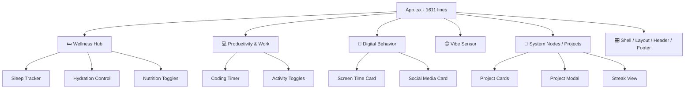

# Refactor Track Freak: Single-File → Modular Architecture

## Current Architecture Analysis

### Overview

The entire application lives in **3 source files**:

| File | Lines | Size | Role |
|------|-------|------|------|
| [App.tsx](file:///d:/coder_cave/projects/antigravity/track-freak/src/App.tsx) | 1,611 | 85.6 KB | Everything — types, components, hooks, state, layout, business logic |
| [index.css](file:///d:/coder_cave/projects/antigravity/track-freak/src/index.css) | 396 | 12.6 KB | Design system, glass-card, light theme overrides |
| [main.tsx](file:///d:/coder_cave/projects/antigravity/track-freak/src/main.tsx) | 11 | 231 B | React entry point |

### Components Currently in App.tsx

| Component | Lines | Purpose |
|-----------|-------|---------|
| `SectionHeader` | L45–56 | Icon + title + subtitle header block |
| `IconButton` | L58–80 | Toggle button with active dot indicator |
| `ControlSection` | L82–92 | Animated glass-card wrapper |
| `ToggleButton` | L94–108 | Pill-style toggle with icon |
| `StreakView` | L110–152 | 10-day GitHub-style activity heatmap |
| `ProjectModal` | L154–251 | Full-screen modal for adding projects |
| `AppendRecordButton` | L252–325 | Hold-to-confirm button with progress fill |
| `App` (root) | L329–1610 | **Everything else** — all state, effects, handlers, and inline JSX |

### State Variables in `App` (20+ pieces of state)

| State Group | Variables | Lines |
|-------------|-----------|-------|
| **Sleep/Rest** | `sleep`, `currentSessionSeconds`, `batches` | L334–338 |
| **Hydration** | `water`, `isWaterDragging`, `waterRef`, `isDraggingRef` | L339–342 |
| **Nutrition** | `nutrition` | L343 |
| **Training** | `training` | L344 |
| **Timer/Coding** | `timerSeconds`, `isTimerRunning` | L375–376 |
| **Hobbies** | `reading`, `ukulele` | L377–378 |
| **Digital Behavior** | `consoleLogHours`, `hyperSocialMinutes` | L381–382 |
| **Mood/Stress** | `mood`, `stress` | L469–470 |
| **Projects** | `projects`, `isModalOpen` | L473–497 |
| **UI State** | `mounted`, `isResetHolding`, `holdProgress`, `isLightMode`, `scrollRef` | L330, L537–544, L602 |

### Business Logic Functions (all inline in `App`)

| Function | Purpose |
|----------|---------|
| `updateWaterFromPointer` / `onWaterPointer*` | Drag-to-set water level |
| `formatHyperSocial` | Format minutes → display string |
| `resetDigitalBehavior` | Zero out digital metrics |
| `incrementConsoleLog` / `incrementHyperSocial` | Tap-to-increment counters |
| `formatSleepTime` / `formatTime` | Time formatting utilities |
| `toggleSleep` / `pushManualSleep` | Sleep session management |
| `addTime` | Add time to coding timer |
| `addProject` / `deleteProject` / `toggleProjectSuccess` / `isWorkedToday` | Project CRUD |
| `resetAll` | Full daily reset |

### Feature Domains Identified



---

## Proposed Architecture

### Folder Structure

```
src/
├── main.tsx                          # Entry point (unchanged)
├── index.css                         # Global styles (unchanged)
├── App.tsx                           # Shell: layout, background, nav, header, footer
│
├── types/
│   └── index.ts                      # All shared TypeScript interfaces
│
├── utils/
│   └── formatters.ts                 # formatTime, formatSleepTime, formatHyperSocial
│
├── hooks/
│   ├── useWellness.ts                # Sleep, water, nutrition, training state + logic
│   ├── useProductivity.ts            # Timer, reading, ukulele state + logic
│   ├── useDigitalBehavior.ts         # Console log, hyper-social state + logic
│   ├── useVibe.ts                    # Mood, stress state
│   ├── useProjects.ts               # Projects CRUD, localStorage persistence
│   ├── useTheme.ts                   # Light/dark mode toggle + localStorage
│   ├── useResetAll.ts                # Hold-to-reset orchestration
│   └── useHorizontalScroll.ts        # Inertia scroll physics for project carousel
│
├── components/
│   ├── ui/
│   │   ├── SectionHeader.tsx         # Reusable section header
│   │   ├── IconButton.tsx            # Toggle icon button with active dot
│   │   ├── ToggleButton.tsx          # Pill-style toggle
│   │   ├── ControlSection.tsx        # Glass-card animated wrapper
│   │   └── AppendRecordButton.tsx    # Hold-to-confirm progress button
│   │
│   ├── layout/
│   │   ├── Background.tsx            # Cinematic BG, mesh grid, vignette, scan-line, floating nodes
│   │   ├── Navbar.tsx                # Sticky top status bar
│   │   ├── Header.tsx                # Logo, brand, status metrics, reset/theme/dashboard buttons
│   │   └── Footer.tsx                # Bottom branding + links
│   │
│   └── features/
│       ├── wellness/
│       │   ├── WellnessSection.tsx    # Full Wellness Hub section
│       │   ├── SleepTracker.tsx       # Sleep display, time inputs, batch history
│       │   ├── HydrationControl.tsx   # Water slider + buttons
│       │   └── NutritionGrid.tsx      # Breakfast/lunch/dinner toggles
│       │
│       ├── productivity/
│       │   └── ProductivitySection.tsx # Timer, reading, ukulele, training toggles
│       │
│       ├── digital/
│       │   └── DigitalBehaviorSection.tsx # Console log + social media cards
│       │
│       ├── vibe/
│       │   └── VibeSensorSection.tsx  # Mood emoji picker + stress level grid
│       │
│       └── projects/
│           ├── ProjectsSection.tsx    # Horizontal scroll container + add button
│           ├── ProjectCard.tsx        # Individual project card
│           ├── ProjectModal.tsx       # Add project modal
│           └── StreakView.tsx         # 10-day activity heatmap
```

### Estimated File Count

| Category | Files |
|----------|-------|
| Types | 1 |
| Utils | 1 |
| Hooks | 8 |
| UI Components | 5 |
| Layout Components | 4 |
| Feature Components | 10 |
| Root (`App.tsx`, `main.tsx`, `index.css`) | 3 |
| **Total** | **~32 files** |

---

## File-by-File Migration Plan

### Phase 1: Foundation (Types + Utils + Hooks)

These are pure logic extractions — zero render impact.

---

#### [NEW] [index.ts](file:///d:/coder_cave/projects/antigravity/track-freak/src/types/index.ts)

Extract `Project` interface (L34–41) and add any future type definitions.

```typescript
export interface Project {
  id: string;
  name: string;
  desc: string;
  stack: string;
  category: string;
  history: Record<string, boolean>;
}

export interface SleepState {
  start: string;
  end: string;
  isSleeping: boolean;
}

export interface SleepBatch {
  id: number;
  start: string;
  end: string;
  duration: number;
}

export interface NutritionState {
  breakfast: boolean;
  lunch: boolean;
  dinner: boolean;
}
```

---

#### [NEW] [formatters.ts](file:///d:/coder_cave/projects/antigravity/track-freak/src/utils/formatters.ts)

Extract pure formatting functions from App (L392–397, L426–431, L457–462).

---

#### [NEW] [useWellness.ts](file:///d:/coder_cave/projects/antigravity/track-freak/src/hooks/useWellness.ts)

Extract all sleep/water/nutrition/training state and handlers (L334–455 + water pointer handlers L346–372).

Returns: `{ sleep, setSleep, batches, currentSessionSeconds, toggleSleep, pushManualSleep, totalRestSeconds, water, setWater, waterRef, isWaterDragging, onWaterPointerDown, onWaterPointerMove, onWaterPointerUp, nutrition, setNutrition, training, setTraining }`

---

#### [NEW] [useProductivity.ts](file:///d:/coder_cave/projects/antigravity/track-freak/src/hooks/useProductivity.ts)

Extract timer + hobbies state (L375–412, L464–466).

Returns: `{ timerSeconds, isTimerRunning, setIsTimerRunning, reading, setReading, ukulele, setUkulele, formatTime, addTime }`

---

#### [NEW] [useDigitalBehavior.ts](file:///d:/coder_cave/projects/antigravity/track-freak/src/hooks/useDigitalBehavior.ts)

Extract console log + social media state (L381–402).

Returns: `{ consoleLogHours, hyperSocialMinutes, incrementConsoleLog, incrementHyperSocial, resetDigitalBehavior, formatHyperSocial }`

---

#### [NEW] [useVibe.ts](file:///d:/coder_cave/projects/antigravity/track-freak/src/hooks/useVibe.ts)

Extract mood + stress state (L469–470).

Returns: `{ mood, setMood, stress, setStress }`

---

#### [NEW] [useProjects.ts](file:///d:/coder_cave/projects/antigravity/track-freak/src/hooks/useProjects.ts)

Extract projects state + CRUD + localStorage persistence (L473–535).

Returns: `{ projects, setProjects, isModalOpen, setIsModalOpen, addProject, deleteProject, toggleProjectSuccess, isWorkedToday }`

---

#### [NEW] [useTheme.ts](file:///d:/coder_cave/projects/antigravity/track-freak/src/hooks/useTheme.ts)

Extract light/dark toggle + localStorage sync (L540–554).

Returns: `{ isLightMode, setIsLightMode }`

---

#### [NEW] [useResetAll.ts](file:///d:/coder_cave/projects/antigravity/track-freak/src/hooks/useResetAll.ts)

Extract hold-to-reset logic (L537–600). Will accept setter callbacks from all other hooks via parameters.

Returns: `{ isResetHolding, setIsResetHolding, holdProgress }`

---

#### [NEW] [useHorizontalScroll.ts](file:///d:/coder_cave/projects/antigravity/track-freak/src/hooks/useHorizontalScroll.ts)

Extract inertia scroll physics (L604–671).

Returns: `{ scrollRef }`

---

### Phase 2: UI Components

Extract the 5 standalone presentational components that already exist at the top of App.tsx.

---

#### [NEW] [SectionHeader.tsx](file:///d:/coder_cave/projects/antigravity/track-freak/src/components/ui/SectionHeader.tsx)

Direct extraction of L45–56. No logic changes.

#### [NEW] [IconButton.tsx](file:///d:/coder_cave/projects/antigravity/track-freak/src/components/ui/IconButton.tsx)

Direct extraction of L58–80.

#### [NEW] [ControlSection.tsx](file:///d:/coder_cave/projects/antigravity/track-freak/src/components/ui/ControlSection.tsx)

Direct extraction of L82–92.

#### [NEW] [ToggleButton.tsx](file:///d:/coder_cave/projects/antigravity/track-freak/src/components/ui/ToggleButton.tsx)

Direct extraction of L94–108.

#### [NEW] [AppendRecordButton.tsx](file:///d:/coder_cave/projects/antigravity/track-freak/src/components/ui/AppendRecordButton.tsx)

Direct extraction of L252–325.

---

### Phase 3: Layout Components

Extract structural shell from the App render return.

---

#### [NEW] [Background.tsx](file:///d:/coder_cave/projects/antigravity/track-freak/src/components/layout/Background.tsx)

Extract L678–728 — cinematic BG, mesh grid, vignette, scan-line, floating atmospheric nodes, HUD frame elements.

#### [NEW] [Navbar.tsx](file:///d:/coder_cave/projects/antigravity/track-freak/src/components/layout/Navbar.tsx)

Extract L732–743 — sticky status bar with system online indicator + date.

#### [NEW] [Header.tsx](file:///d:/coder_cave/projects/antigravity/track-freak/src/components/layout/Header.tsx)

Extract L748–949 — logo block, brand title, tech subtitle, system reset button, light mode toggle, dashboard button, and the 3 status metric cards. Props for theme toggle, reset handlers, holdProgress.

#### [NEW] [Footer.tsx](file:///d:/coder_cave/projects/antigravity/track-freak/src/components/layout/Footer.tsx)

Extract L1579–1606 — branding, links, philosophical quote.

---

### Phase 4: Feature Sections

Extract the 5 major content sections into self-contained feature components.

---

#### [NEW] [WellnessSection.tsx](file:///d:/coder_cave/projects/antigravity/track-freak/src/components/features/wellness/WellnessSection.tsx)

Orchestrator wrapping ControlSection with SectionHeader. Delegates to sub-components.

#### [NEW] [SleepTracker.tsx](file:///d:/coder_cave/projects/antigravity/track-freak/src/components/features/wellness/SleepTracker.tsx)

Extract L957–1098 — total rest display, time inputs, batch history, sleep trigger button.

#### [NEW] [HydrationControl.tsx](file:///d:/coder_cave/projects/antigravity/track-freak/src/components/features/wellness/HydrationControl.tsx)

Extract L1124–1188 — water drag slider + buttons.

#### [NEW] [NutritionGrid.tsx](file:///d:/coder_cave/projects/antigravity/track-freak/src/components/features/wellness/NutritionGrid.tsx)

Extract L1100–1122 — 3-column breakfast/lunch/dinner toggle grid.

---

#### [NEW] [ProductivitySection.tsx](file:///d:/coder_cave/projects/antigravity/track-freak/src/components/features/productivity/ProductivitySection.tsx)

Extract L1192–1273 — coding timer display, start/stop, time add buttons, reading/ukulele/training toggles.

---

#### [NEW] [DigitalBehaviorSection.tsx](file:///d:/coder_cave/projects/antigravity/track-freak/src/components/features/digital/DigitalBehaviorSection.tsx)

Extract L1275–1346 — console log card, hyper-social card, system cleanse button.

---

#### [NEW] [VibeSensorSection.tsx](file:///d:/coder_cave/projects/antigravity/track-freak/src/components/features/vibe/VibeSensorSection.tsx)

Extract L1348–1468 — emotional index emoji picker, internal tension stress grid.

---

#### [NEW] [ProjectsSection.tsx](file:///d:/coder_cave/projects/antigravity/track-freak/src/components/features/projects/ProjectsSection.tsx)

Extract L1470–1571 — section header, horizontal scroll container, add-new ghost card.

#### [NEW] [ProjectCard.tsx](file:///d:/coder_cave/projects/antigravity/track-freak/src/components/features/projects/ProjectCard.tsx)

Extract L1486–1544 — individual project card with category, name, desc, stack tags, streak view, sync button.

#### [NEW] [ProjectModal.tsx](file:///d:/coder_cave/projects/antigravity/track-freak/src/components/features/projects/ProjectModal.tsx)

Direct extraction of L154–251 (already a standalone component).

#### [NEW] [StreakView.tsx](file:///d:/coder_cave/projects/antigravity/track-freak/src/components/features/projects/StreakView.tsx)

Direct extraction of L110–152 (already a standalone component).

---

### Phase 5: Rewrite App.tsx

#### [MODIFY] [App.tsx](file:///d:/coder_cave/projects/antigravity/track-freak/src/App.tsx)

The root `App.tsx` becomes a **thin shell** (~80–100 lines) that:
1. Calls all custom hooks
2. Renders the layout structure (`Background`, `Navbar`, `Header`, `main`, `Footer`)
3. Passes hook returns as props to feature sections
4. Handles the `mounted` guard

```tsx
// Conceptual final App.tsx (~80 lines)
export default function App() {
  const [mounted, setMounted] = useState(false);
  useEffect(() => setMounted(true), []);

  const wellness = useWellness();
  const productivity = useProductivity();
  const digital = useDigitalBehavior();
  const vibe = useVibe();
  const projects = useProjects();
  const theme = useTheme();
  const reset = useResetAll({ /* setter callbacks */ });
  const { scrollRef } = useHorizontalScroll(mounted);

  if (!mounted) return null;

  return (
    <div className="min-h-screen ...">
      <Background />
      <Navbar />
      <main className="...">
        <Header {...theme} {...reset} />
        <WellnessSection {...wellness} />
        <ProductivitySection {...productivity} />
        <DigitalBehaviorSection {...digital} />
        <VibeSensorSection {...vibe} />
        <ProjectsSection {...projects} scrollRef={scrollRef} />
        <ProjectModal ... />
        <Footer />
      </main>
    </div>
  );
}
```

---

## Files NOT Modified

| File | Reason |
|------|--------|
| [index.css](file:///d:/coder_cave/projects/antigravity/track-freak/src/index.css) | Styling must not change — stays exactly as-is |
| [main.tsx](file:///d:/coder_cave/projects/antigravity/track-freak/src/main.tsx) | Entry point unchanged |
| [vite.config.ts](file:///d:/coder_cave/projects/antigravity/track-freak/vite.config.ts) | Build config unchanged |
| [tsconfig.json](file:///d:/coder_cave/projects/antigravity/track-freak/tsconfig.json) | TypeScript config unchanged |
| [package.json](file:///d:/coder_cave/projects/antigravity/track-freak/package.json) | No new dependencies needed |

---

## Potential Risks

| Risk | Impact | Mitigation |
|------|--------|------------|
| **Framer Motion `layoutId` breaks across component boundaries** | Shared layout animations (`active-dot`, `mood-aura`, `mood-ring`, `stress-glow`) require the same `AnimatePresence` ancestor | Keep all mood/stress buttons inside a single component; ensure `layoutId` strings remain unique globally |
| **CSS class specificity / light-mode overrides break** | `index.css` targets specific dark-mode utility classes by exact selector — if component structure or class order changes, overrides may stop matching | We are **not changing any class names or JSX structure** — only moving them to separate files. Selectors target Tailwind class patterns, not DOM hierarchy |
| **`useRef` sharing across component boundaries** | `waterRef` and `scrollRef` are created in `App` and passed to children — if passed incorrectly, pointer capture / scroll physics break | Pass refs as props or create inside the owning hook and return them |
| **`resetAll` function needs access to 8+ setter functions** | The reset orchestrator calls setters from every hook | `useResetAll` accepts a config object of reset callbacks from each hook |
| **State lifting / prop drilling** | Feature sections need state from hooks — could lead to verbose prop passing | Hooks return grouped objects; props are spread at the `App` level. If this becomes unwieldy in the future, a context layer can be added, but is overkill for this scale |
| **`Math.random()` in HUD V_ID** | Currently generates new ID on every render (L721) — this is existing behavior, not introduced by refactor | Not fixing; preserving current behavior |

---

## Verification Plan

### Automated Tests

```bash
# TypeScript compilation — zero errors expected
npm run lint

# Production build — zero warnings expected
npm run build
```

### Visual Verification

- Run `npm run dev` and compare every section side-by-side with the current app
- Verify dark mode appearance
- Verify light mode appearance (toggle)
- Test sleep session start/stop
- Test manual sleep append
- Test water drag + buttons
- Test nutrition toggles
- Test coding timer start/stop/add time
- Test reading/ukulele/training toggles
- Test console log + hyper-social increment
- Test mood emoji picker + stress grid
- Test project card scroll (horizontal inertia)
- Test project add modal
- Test project delete + sync progress toggle
- Test system reset (hold button)
- Test streak view renders correctly

---

## Summary

| Metric | Before | After |
|--------|--------|-------|
| Source files | 3 | ~32 |
| Largest file | 1,611 lines | ~100 lines (App.tsx) |
| Components | 8 (all in one file) | 19 (organized by domain) |
| Custom hooks | 0 | 8 |
| Type definitions | Inline | Centralized |
| Utility functions | Inline | Centralized |
| Visual changes | — | **None** |
| New dependencies | — | **None** |
| New features | — | **None** |
